# ScamShield AI — System Architecture

| | |
|---|---|
| **Document Version** | 1.0 |
| **Status** | Approved |
| **Last Updated** | July 2026 |
| **Audience** | Engineering |
| **Related Documents** | [01_Vision.md](./01_Vision.md), [03_TechStack.md](./03_TechStack.md), [05_Database.md](./05_Database.md) |

---

## Table of Contents

1. [Architecture Overview](#1-architecture-overview)
2. [High-Level Architecture Diagram](#2-high-level-architecture-diagram)
3. [Frontend Architecture](#3-frontend-architecture)
4. [Backend Architecture](#4-backend-architecture)
5. [Authentication Flow](#5-authentication-flow)
6. [AI Processing Pipeline](#6-ai-processing-pipeline)
7. [Scan Pipelines](#7-scan-pipelines)
8. [Database Interaction](#8-database-interaction)
9. [External Services](#9-external-services)
10. [Chrome Extension Architecture](#10-chrome-extension-architecture)
11. [Folder Relationship Diagram](#11-folder-relationship-diagram)
12. [Scalability](#12-scalability)
13. [Security Layers](#13-security-layers)
14. [Error Handling Flow](#14-error-handling-flow)
15. [Notification Architecture](#15-notification-architecture)
16. [Asynchronous Processing](#16-asynchronous-processing)
17. [Monitoring and Observability](#17-monitoring-and-observability)
18. [API Gateway](#18-api-gateway)
19. [Future Considerations](#19-future-considerations)
20. [Conclusion](#20-conclusion)

---

## 1. Architecture Overview

ScamShield AI is a multi-tier, service-oriented web platform built for high correctness, low latency, and horizontal scalability. The system is organized into four primary concerns:

- **Presentation** — A React single-page application that renders the user interface, manages client-side state, and communicates exclusively through a typed API layer.
- **Application** — A Node.js/Express REST API that handles authentication, request routing, input validation, and orchestration of business logic across services.
- **Intelligence** — A purpose-built AI processing pipeline that accepts structured scan requests, builds contextual prompts, invokes the Gemini language model, and transforms model output into structured risk assessments.
- **Persistence** — A MongoDB database that stores user accounts, scan records, analysis results, and session metadata.

These four concerns are connected by well-defined interfaces. No layer bypasses the layer immediately above or below it. The frontend never touches the database. The database layer never contains business logic. The AI pipeline is fully isolated behind the service layer and is replaceable without impacting the API contract.

The system is deployed as two separate processes: the React frontend served as a static build behind a CDN, and the Express backend running as a managed Node.js service. This separation allows the frontend and backend to scale, deploy, and fail independently.

The Chrome extension operates as a thin client: it renders a popup UI and delegates all analysis to the same backend API used by the web application. It shares no logic with the browser and requires no separate backend infrastructure.

---

## 2. High-Level Architecture Diagram

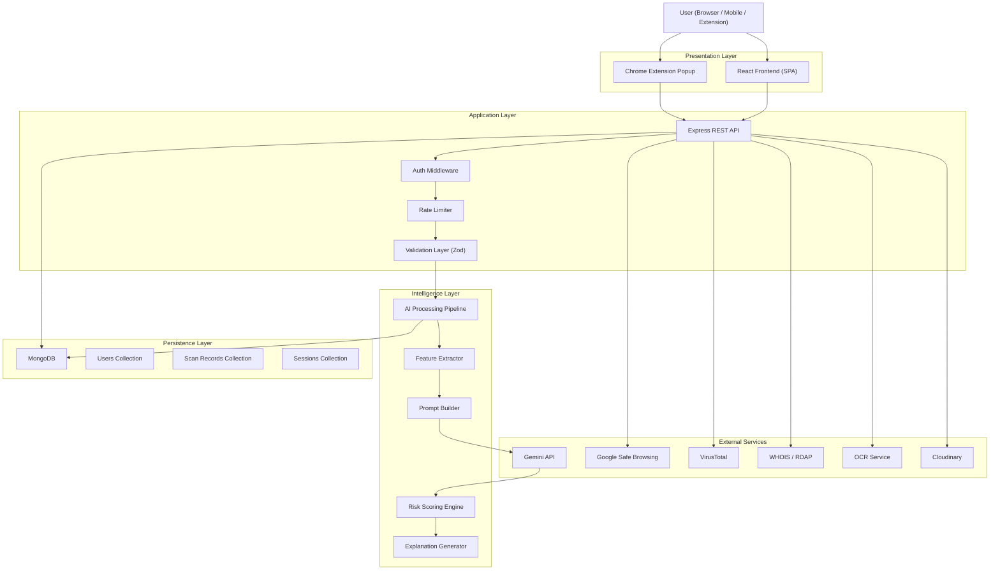

---

## 3. Frontend Architecture

### 3.1 Technology Foundation

The frontend is a React 18 single-page application written entirely in TypeScript. It is bundled with Vite for fast development iteration and optimized production builds. All components are functional; no class components are used.

### 3.2 Feature-Based Architecture

The source tree is organized by product feature, not by file type. Each feature directory is a self-contained vertical slice: it owns its pages, components, hooks, and API calls. Shared primitives — buttons, modals, badges, form fields — live in a top-level `components/` directory and have no feature-specific dependencies.

```
client/src/
├── features/
│   ├── auth/               ← Registration, login, password reset
│   ├── dashboard/          ← Activity summary, quick-scan entry points
│   ├── url-scanner/        ← URL scan form and results
│   ├── email-scanner/      ← Email scan form and results
│   ├── sms-scanner/        ← SMS scan form and results
│   ├── image-scanner/      ← Image upload and results
│   ├── qr-scanner/         ← QR upload and decoded URL results
│   └── scan-history/       ← Searchable history log
├── components/             ← Shared UI primitives
├── hooks/                  ← Shared custom hooks
├── lib/                    ← API client, formatters, constants
├── store/                  ← Global state slices
├── styles/                 ← Design tokens, global CSS
└── main.tsx
```

### 3.3 Routing

Client-side routing is handled by React Router v6. Routes are code-split at the feature level so that each scanner page is loaded on demand. Authentication-gated routes are wrapped in a `ProtectedRoute` component that validates the presence and expiry of the user session before rendering.

```
/                     → Dashboard (protected)
/login                → Login page
/register             → Registration page
/scan/url             → URL Scanner (protected)
/scan/email           → Email Scanner (protected)
/scan/sms             → SMS Scanner (protected)
/scan/image           → Image Scanner (protected)
/scan/qr              → QR Scanner (protected)
/history              → Scan History (protected)
/history/:scanId      → Individual scan result (protected)
```

### 3.4 State Management

State is divided into two layers:

- **Server state** — data fetched from the API (scan results, history, user profile) is managed by React Query. It handles caching, background refetching, loading states, and optimistic updates.
- **Client state** — ephemeral UI state (sidebar open/closed, active scan type, modal visibility) is managed by Zustand. The store is minimal: anything that can be derived from server state is not duplicated in the Zustand store.

### 3.5 API Layer

All API calls are centralised in `client/src/lib/api/`. No component imports `fetch` directly. Each feature has a corresponding API module that exports typed async functions. A shared `apiClient` instance handles base URL configuration, JWT attachment via request interceptors, and 401 response handling for automatic token refresh.

### 3.6 UI Layer and Reusable Components

The design system is built from a small set of composable primitives:

| Component | Purpose |
|-----------|---------|
| `Button` | All interactive triggers; variants: primary, secondary, ghost, destructive |
| `Badge` | Risk level indicators: Safe, Low, Medium, High, Critical |
| `Card` | Content container with consistent padding and border treatment |
| `Modal` | Overlay dialogs; focus-trapped, keyboard-dismissible |
| `Input` / `Textarea` | Form fields with built-in error state display |
| `Spinner` | Loading indicator for async operations |
| `RiskMeter` | Visual representation of a 0–100 risk score |
| `ScanResultCard` | Standardized layout for any scan result type |
| `Toast` | Non-blocking feedback notifications |

### 3.7 Component Hierarchy Diagram

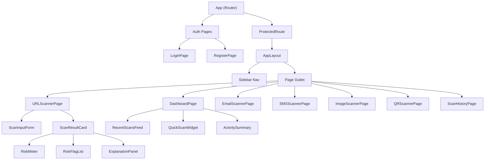

---

## 4. Backend Architecture

### 4.1 Technology Foundation

The backend is a Node.js application using the Express framework, written entirely in TypeScript and executed via `tsx` for development and compiled to JavaScript for production. It follows a strict four-layer architecture: Routes → Controllers → Services → Repositories.

### 4.2 Layer Responsibilities

| Layer | File Pattern | Responsibility |
|-------|-------------|----------------|
| **Routes** | `*.routes.ts` | Declare HTTP method, path, and middleware chain |
| **Controllers** | `*.controller.ts` | Read request, call one service function, write response |
| **Services** | `*.service.ts` | Business logic, orchestration of repositories and external calls |
| **Repositories** | `*.repository.ts` | MongoDB queries only; no business logic |

### 4.3 Request Lifecycle

Every inbound HTTP request passes through a fixed middleware pipeline before it reaches a controller:

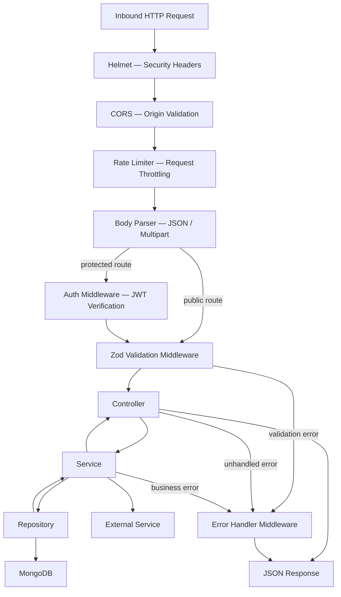

### 4.4 Feature Module Structure

Each product feature is encapsulated in its own module directory under `server/src/features/`. A module owns every layer of its vertical slice.

```
server/src/features/
├── auth/
│   ├── auth.routes.ts
│   ├── auth.controller.ts
│   ├── auth.service.ts
│   ├── auth.repository.ts
│   ├── auth.schema.ts
│   └── auth.types.ts
├── scan-url/
├── scan-email/
├── scan-sms/
├── scan-image/
├── scan-qr/
├── scan-history/
└── dashboard/
```

### 4.5 Shared Infrastructure

```
server/src/
├── middleware/
│   ├── auth.middleware.ts       ← JWT verification
│   ├── validate.middleware.ts   ← Zod schema validation
│   ├── rateLimit.middleware.ts  ← Per-route throttling
│   └── errorHandler.middleware.ts
├── config/
│   ├── db.ts                   ← MongoDB connection
│   ├── env.ts                  ← Validated environment config
│   └── logger.ts               ← Structured logging
├── lib/
│   ├── gemini.client.ts        ← Gemini API wrapper
│   ├── cloudinary.client.ts    ← Image upload client
│   └── ocr.client.ts           ← OCR service wrapper
└── index.ts                    ← Server bootstrap
```

---

## 5. Authentication Flow

ScamShield AI uses a stateless JWT-based authentication scheme. Access tokens are short-lived; refresh tokens are stored in an HTTP-only cookie and rotated on each use.

### 5.1 Flow Diagram

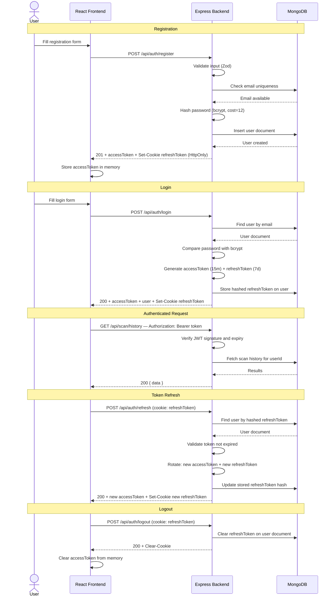

### 5.2 Token Security Posture

| Property | Access Token | Refresh Token |
|----------|-------------|---------------|
| Storage | In-memory (JS variable) | HTTP-only cookie |
| Expiry | 15 minutes | 7 days |
| Transmission | Authorization header | Automatic via cookie |
| Rotation | On each refresh | On each refresh (single-use) |
| Revocation | Implicit on expiry | Explicit: cleared from DB on logout |

The access token is never written to `localStorage` or `sessionStorage`. Storing it in memory means it is lost on page refresh — a silent refresh call on application load obtains a new access token from the valid refresh token cookie. This is intentional; it eliminates the most common XSS-based token theft vector.

---

## 6. AI Processing Pipeline

The AI pipeline is the core intelligence layer. It accepts a structured scan request from the service layer and produces a structured risk report. It is fully isolated: the pipeline knows nothing about HTTP, authentication, or the database. It receives typed input and returns typed output.

### 6.1 Pipeline Diagram

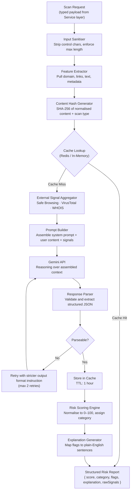

### 6.2 Stage Descriptions

**Input Sanitiser** strips null bytes, control characters, and enforces per-scan-type length limits before any downstream processing occurs. Invalid input fails immediately with a structured error.

**Feature Extractor** is scan-type-aware. For a URL it parses the domain, subdomain chain, path, query string, and fragment. For an email body it extracts all links, the sender display name, and subject line. For an image, the OCR output is treated as the text corpus for subsequent stages.

**External Signal Aggregator** fans out to external APIs in parallel — Google Safe Browsing for URL reputation, VirusTotal for multi-engine verdicts, WHOIS/RDAP for domain registration age — and collects results under a timeout. A signal that times out contributes a `null` value rather than blocking the pipeline.

**Prompt Builder** assembles a structured prompt that includes the scan content, the raw signals from the aggregator, the scan type, and explicit formatting instructions for the model's output. The system prompt instructs the model to reason step-by-step and return its findings as a JSON object conforming to a known schema.

**Gemini API** receives the assembled prompt and returns a completion. The pipeline is model-agnostic at this stage: swapping the provider requires only changing the client in `lib/gemini.client.ts`.

**Response Parser** validates the model's JSON output against a Zod schema. If parsing fails, the pipeline retries up to two times with an explicit instruction to correct the format. After three failures, the pipeline returns a graceful error.

**Risk Scoring Engine** normalises the model's confidence and signal weight outputs into a 0–100 integer score and assigns a categorical label: Safe (0–19), Low Risk (20–39), Medium Risk (40–59), High Risk (60–79), Critical (80–100).

**Explanation Generator** maps the raw flags produced by the model into user-facing plain-English sentences, ordered by risk contribution.

### 6.3 AI Result Cache

Calling the Gemini API for every scan request — including identical content submitted by different users — is both unnecessary and costly. The AI result cache intercepts the pipeline after feature extraction, computes a deterministic hash of the normalised scan content and scan type, and checks a cache store before dispatching any prompt to the model.

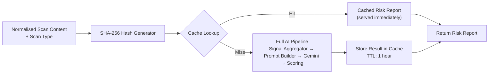

**Cache implementation options:**

| Option | Use Case | Trade-off |
|--------|---------|-----------|
| In-memory (`Map`) | MVP / single server instance | Lost on process restart; not shared across multiple instances |
| Redis | Production / multi-instance deployments | Shared across instances, persistent, survives restarts; requires an additional service |
| MongoDB TTL collection | Fallback / minimal-infrastructure deployments | Slower reads than Redis; suitable when Redis is not available |

The cache key is a SHA-256 hash of the canonicalised scan content combined with the scan type. Two URL scans for the same URL submitted by different users within the TTL window produce the same key — the second request is served from cache without contacting Gemini. Cache entries expire after one hour; entries associated with a newly confirmed threat signal are evicted immediately when intelligence data changes.

The cache is the one component in the AI pipeline that is explicitly designed for a swappable implementation. The interface is defined from the start; the backing store is a configuration choice.

---

## 7. Scan Pipelines

Each scanner shares the same AI processing pipeline at its core but has a distinct pre-processing stage that extracts and normalises content before handing off to the pipeline.

### 7.1 URL Scan Pipeline

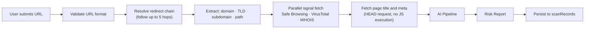

**Unique signals:** Domain age, number of redirects, IP address as host, lookalike domain score (edit distance from known brands), SSL issuer, redirect final destination mismatch.

---

### 7.2 Email Scan Pipeline

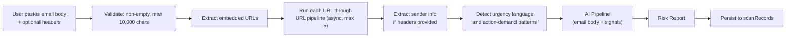

**Unique signals:** Urgency keyword density, financial action requests, sender display name vs. domain mismatch, number of embedded URLs, brand name vs. sender domain mismatch.

---

### 7.3 SMS Scan Pipeline

```mermaid
flowchart LR
    A["User pastes SMS text"] --> B["Validate: non-empty, max 1,600 chars"]
    B --> C["Extract embedded URLs\nincluding shortlinks"]
    C --> D["Expand shortlinks\nroute through URL pipeline"]
    D --> E["Detect phone number patterns"]
    E --> F["Detect smishing keywords\nparcel · OTP · prize · bank"]
    F --> G["AI Pipeline\n(SMS text + signals)"]
    G --> H["Risk Report"]
    H --> I["Persist to scanRecords"]
```

**Unique signals:** Shortlink ratio, OTP solicitation language, impersonation of delivery service or government agency, unexpected callback number, unsolicited financial claim.

---

### 7.4 QR Code Scan Pipeline

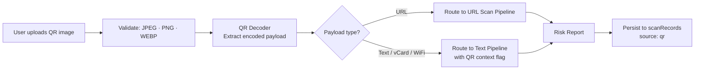

**Unique signals:** Redirect through shortener immediately after decode, payload type mismatch, destination domain registered within 7 days.

---

### 7.5 Image Scan Pipeline

```mermaid
flowchart LR
    A["User uploads image"] --> B["Validate: type, max 10 MB"]
    B --> C["Upload to Cloudinary\ntemporary, auto-delete 24 h"]
    C --> D["OCR — Extract all text\nfrom image"]
    D --> E["URL extraction\nfrom OCR text"]
    E --> F["Run extracted URLs\nthrough URL pipeline"]
    F --> G["Brand logo detection\nknown brand asset hashing"]
    G --> H["AI Pipeline\n(OCR text + URL signals + visual flags)"]
    H --> I["Risk Report"]
    I --> J["Persist to scanRecords\nsource: image"]
```

**Unique signals:** OCR-extracted URL presence, brand logo detected but domain mismatch, text overlaid on image, displayed URL vs. actual destination mismatch.

---

## 8. Database Interaction

### 8.1 Communication Model

The database is never accessed directly by the frontend. The communication path is strictly:

```
React Frontend
      ↓  (HTTPS REST)
Express Backend
      ↓  (Mongoose ODM)
MongoDB
```

The Mongoose ODM enforces schema validation at the application level before any write reaches the database. Repository functions are the only code that holds Mongoose model references. Services call repositories; controllers call services.

### 8.2 Connection Management

A single MongoDB connection pool is established when the server starts and is shared across all requests. The pool size is configurable via environment variables. The server refuses to start if the database connection cannot be established within the configured timeout period.

### 8.3 Core Collections

| Collection | Owner Service | Primary Purpose |
|------------|--------------|-----------------|
| `users` | Auth | Account credentials, refreshToken hash, profile metadata |
| `scanRecords` | All scan services | Full scan payload, risk report, userId, scan type, timestamp |
| `sessions` | Auth | Audit log of login events: IP, device fingerprint, timestamp |

### 8.4 Query Patterns

All queries that filter on `userId` or `createdAt` are covered by compound indexes. All collections include `isDeleted` and `deletedAt` fields; application-level query builders exclude soft-deleted records by default. No raw query strings are composed at runtime — all queries use Mongoose's parameterised API.

---

## 9. External Services

ScamShield AI integrates with external services in two categories: **intelligence sources** that enrich scan analysis, and **infrastructure services** that support content handling.

### 9.1 Intelligence Sources

#### Gemini API (Google)

The primary AI reasoning engine. Receives assembled prompts containing scan content and pre-extracted signals. Returns structured JSON risk assessments. All calls are authenticated via API key stored in environment variables and are never exposed to the client.

**Failure mode:** If the Gemini API is unavailable, the scan pipeline returns a degraded result — surface-level signal scoring only, no AI reasoning. The user is informed the AI analysis is temporarily unavailable.

#### Google Safe Browsing API

Evaluates URLs against Google's continuously updated database of known phishing, malware, and unwanted software sites. Used as one signal within the URL and QR scan pipelines.

#### VirusTotal (Optional / Configurable)

Multi-engine URL and domain reputation check across 70+ security vendors. Provides a second opinion on URL risk. ScamShield AI implements a local cache layer to avoid re-querying the same URL within a 1-hour window.

#### WHOIS / RDAP

Domain registration age and registrar data. Freshly registered domains (under 30 days) are a significant risk signal. ScamShield AI queries RDAP where available (structured JSON response) and falls back to WHOIS parsing. Results are cached for 24 hours per domain.

#### URL Reputation APIs

Additional domain reputation signals from public blocklist aggregators. Used as supplementary evidence when Safe Browsing and VirusTotal signals are inconclusive.

### 9.2 Infrastructure Services

#### OCR Service

Extracts text from uploaded images. Called with the Cloudinary-hosted image URL and returns a flat text corpus. ScamShield AI uses a cloud-hosted OCR provider rather than self-hosted OCR to avoid scaling a compute-intensive workload on the primary application server.

#### Cloudinary

Handles temporary storage of user-uploaded images. Images are uploaded with a 24-hour auto-expiry policy. Cloudinary's transformation pipeline normalises images before they are forwarded to the OCR service. No image is stored permanently unless the user explicitly requests scan archival.

### 9.3 External Service Dependency Map

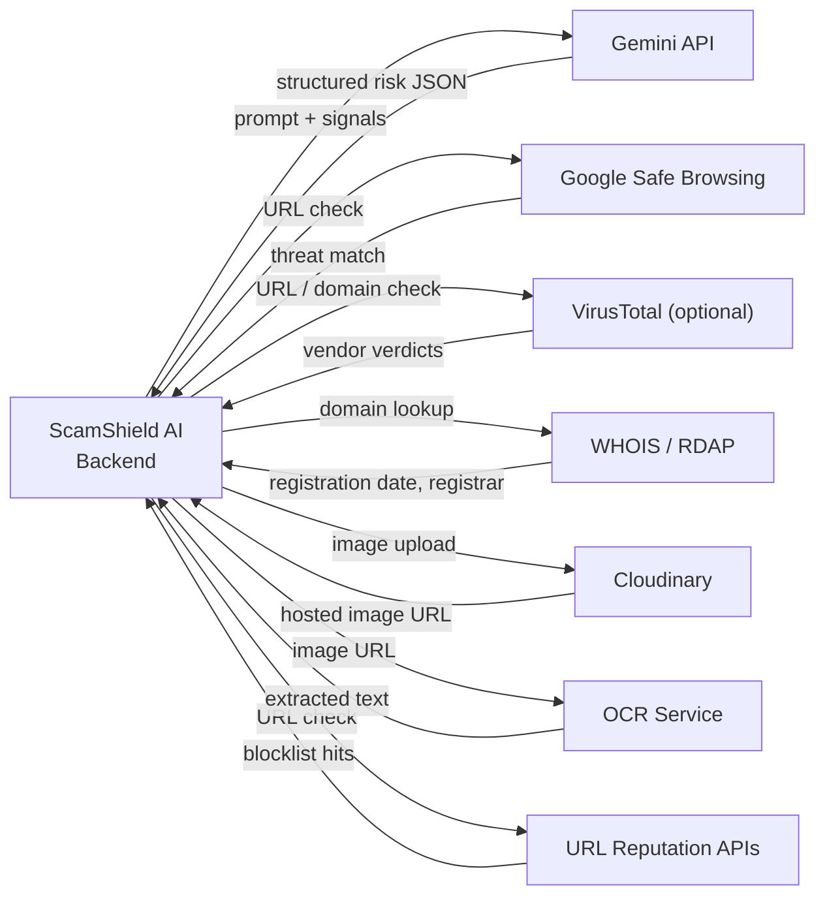

---

## 10. Chrome Extension Architecture

The Chrome extension is a thin client that presents ScamShield AI within the browser without operating any independent backend logic. All analysis is delegated to the same Express API used by the web application.

### 10.1 Component Structure

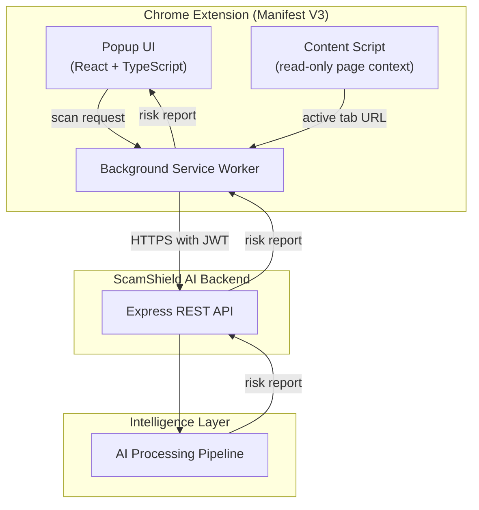

### 10.2 Layer Responsibilities

**Popup UI** renders the extension interface. It reads the active tab URL via the Chrome extension API and pre-populates the URL scan form. It uses the same React component primitives — `ScanResultCard`, `RiskMeter`, `Badge` — as the web application to maintain visual consistency.

**Background Service Worker** manages the extension's persistent state and handles all network calls. It holds the JWT access token in `chrome.storage.session` (in-memory, cleared when the browser closes) and attaches it to every API request. It receives messages from the popup, issues API requests, and returns results.

**Content Script** is a read-only observer. It does not modify the DOM of visited pages. Its only function is to detect the current page URL and pass it to the Background Service Worker for passive analysis. Content scripts are injected only on HTTP/HTTPS pages.

### 10.3 Authentication in the Extension

Users sign in via the popup's login form, which calls `/api/auth/login` and receives an access token. The access token is stored in `chrome.storage.session`. The refresh token is stored in `chrome.storage.local` and persisted across browser restarts. Token refresh follows the same flow as the web application.

---

## 11. Folder Relationship Diagram

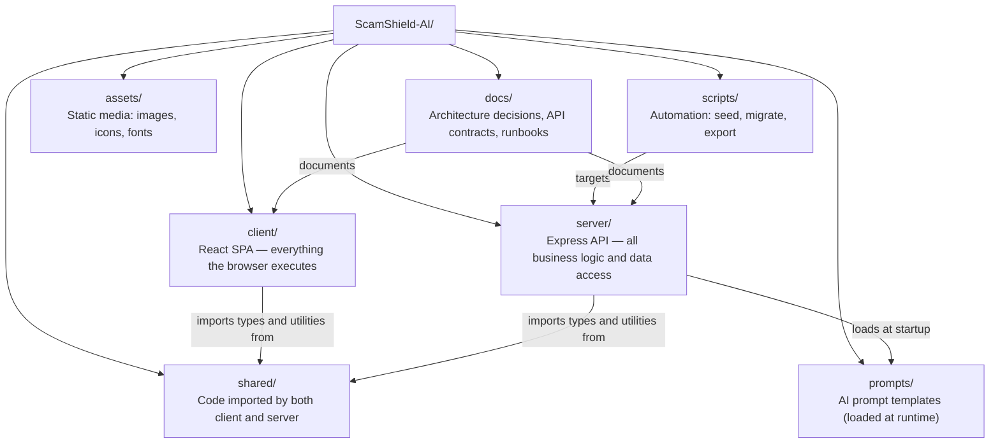

### Dependency Rules

| Direction | Allowed? | Reason |
|-----------|---------|--------|
| `client` → `shared` | Yes | Shared types and pure utilities |
| `server` → `shared` | Yes | Shared types and pure utilities |
| `client` → `server` | Never | No direct import; communication via HTTP only |
| `server` → `client` | Never | Backend has no knowledge of the UI |
| `shared` → `client` | Never | Would create a circular dependency |
| `shared` → `server` | Never | Would create a circular dependency |
| `server` → `prompts` | Yes (runtime read) | Server loads prompt files from disk at startup |

---

## 12. Scalability

The architecture is designed so that adding new capabilities requires adding new modules, not modifying existing ones.

### 12.1 Adding New Scanners

Each scanner is an isolated feature module on both the frontend and backend. To add a new scanner type — for example, a Voice Transcript Scanner:

1. Add `server/src/features/scan-transcript/` with its own route, controller, service, and schema.
2. Register the route in `server/src/index.ts`.
3. Add `client/src/features/transcript-scanner/` with its form, result view, and API module.
4. Add the scan type to the `ScanType` enum in `shared/types/`.

No existing scanner code is modified. The AI pipeline accepts the new scan type by virtue of the prompt builder's scan-type-aware context assembly.

### 12.2 Mobile Application

The mobile application is treated architecturally as an additional client. It communicates with the same Express backend using the same authentication scheme and the same endpoint contracts. The `shared/types/` package ensures the mobile app's API client consumes the same response shapes without duplication.

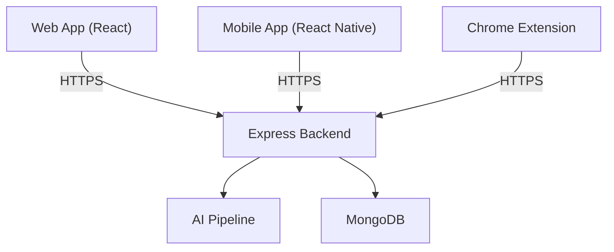

### 12.3 Enterprise Version

The enterprise tier adds multi-tenancy without structural changes to the core architecture. An `organizationId` field is added to the user and scan record schemas. An organization-scoped middleware validates that users can only access data belonging to their organization. Enterprise features — team management, role-based access, bulk scanning APIs — are new feature modules added alongside existing ones, not modifications to existing code.

### 12.4 Developer API

The developer API is a versioned extension of the existing Express backend exposed under an `/api/v1/` prefix with API key authentication instead of JWT. Rate limiting is enforced per API key. The same service layer and AI pipeline are reused without modification.

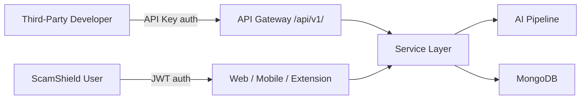

---

## 13. Security Layers

Security is applied in layers. No single mechanism is the sole defence against any given threat class.

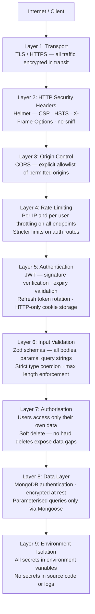

### Security Mechanism Placement Summary

| Mechanism | Applied At | Protects Against |
|-----------|-----------|-----------------|
| TLS / HTTPS | Network | Interception, man-in-the-middle |
| Helmet | Express global middleware | Clickjacking, MIME sniffing, XSS via headers |
| CORS | Express global middleware | Cross-origin request forgery |
| Rate limiting | Express route middleware | Brute force, DoS, API abuse |
| JWT verification | Auth middleware (per protected route) | Unauthorized access to protected resources |
| Zod validation | Validation middleware (per route) | Injection, malformed input, type confusion |
| Authorisation checks | Service layer | Insecure direct object reference (IDOR) |
| bcrypt hashing | Auth service | Password compromise via database leak |
| HTTP-only cookies | Auth response headers | XSS-based token theft |
| Environment variables | Config layer | Secret exposure in source code |

---

## 14. Error Handling Flow

All errors, regardless of origin, converge on a single error-handling middleware. No route, controller, or service formats its own error response.

### 14.1 Error Flow Diagram

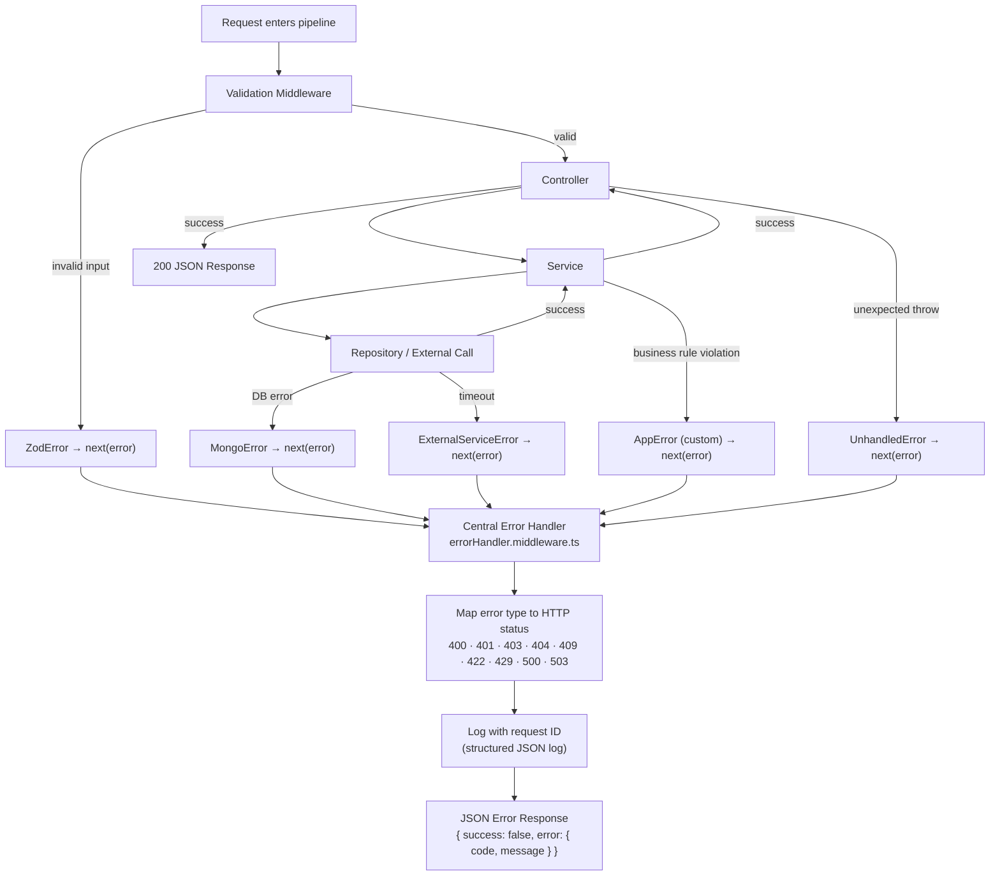

### 14.2 Error Classification

| Error Class | HTTP Status | When Used |
|-------------|------------|-----------|
| `ValidationError` | 400 | Zod schema rejection |
| `AuthenticationError` | 401 | Missing or invalid JWT |
| `AuthorizationError` | 403 | Valid JWT, insufficient permissions |
| `NotFoundError` | 404 | Resource does not exist |
| `ConflictError` | 409 | Duplicate resource (e.g., email already registered) |
| `RateLimitError` | 429 | Too many requests |
| `ExternalServiceError` | 503 | Downstream API unavailable |
| `InternalError` | 500 | Unexpected — logged with full stack, generic message to client |

### 14.3 Client-Side Error Handling

The API client intercepts all responses via axios/fetch interceptors. On a `401`, it attempts a silent token refresh; if the refresh fails, it clears the session and redirects to `/login`. On `429`, it surfaces a user-friendly rate limit message. On `503`, it informs the user that the analysis service is temporarily unavailable. Error details from the server are displayed when they are safe to expose (400, 409, 429); internal errors display a generic message only.

---

## 15. Notification Architecture

### 15.1 Overview

Notifications are a first-class concern, not an afterthought. ScamShield AI sends transactional emails for authentication flows and alert emails when the platform detects high-risk activity. The notification system is intentionally modular: the application calls a single `NotificationService` interface, and the underlying provider is a runtime configuration choice. Swapping providers requires no changes to calling code.

### 15.2 Notification Types

| Type | Trigger | Channel |
|------|---------|---------|
| Email Verification | User registers | Email |
| Password Reset | User requests reset | Email |
| Scan Completion | High-risk result (user opt-in) | Email |
| Security Alert | Login from unrecognised device | Email |
| Push Notification | High-risk scan on mobile / extension | Future: FCM / Web Push |

### 15.3 Architecture Diagram

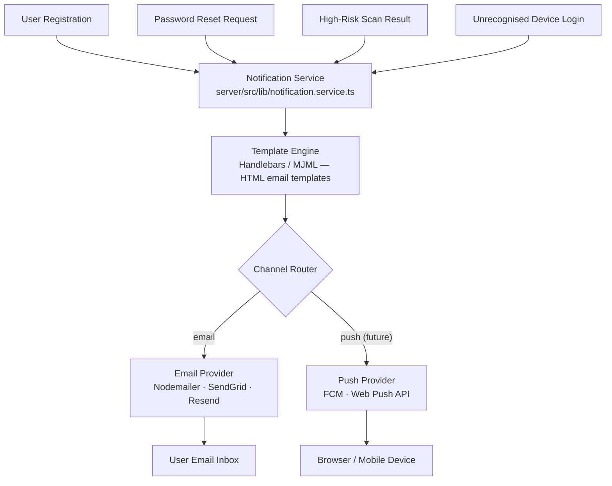

### 15.4 Modularity

The `NotificationService` accepts a typed notification payload and dispatches it through the configured provider. Adding SMS via Twilio or switching from Nodemailer to Resend requires only adding a new provider adapter that satisfies the `INotificationProvider` interface. Email templates are stored as Handlebars files in `server/src/features/notifications/templates/` and are updated independently of application logic. All notification dispatch is performed asynchronously via the background job queue described in Section 16 — notification sending never blocks the API response cycle.

---

## 16. Asynchronous Processing

### 16.1 Why Async Matters

Certain operations must never block the HTTP response cycle. A user submitting an image for scanning should not wait synchronously while OCR extraction, Cloudinary upload, and AI analysis complete — that sequence can take 10–30 seconds, well beyond acceptable API response latency and HTTP client timeouts. Similarly, sending an email, running a cleanup job, or aggregating analytics data are work that can and should happen outside the request lifecycle.

ScamShield AI offloads all long-running and deferrable work to a background job queue. The API acknowledges the request immediately (`202 Accepted`) and a dedicated worker process completes the analysis, persists the result, and signals the client when the job is done.

### 16.2 Task Classification

| Task | Why Async | Worker |
|------|----------|--------|
| OCR text extraction | Variable latency, depends on image size and provider | Image Worker |
| Image upload to Cloudinary | Network I/O, upstream latency outside our control | Image Worker |
| AI analysis (long prompts) | 2–15 second model inference latency | AI Worker |
| AI retry on parse failure | Cascading latency on repeated model calls | AI Worker |
| Email sending | Network I/O, non-critical to request response | Notification Worker |
| Expired image cleanup | Scheduled, non-urgent, batch operation | Cleanup Worker |
| Analytics aggregation | Batch, non-real-time, high write volume | Analytics Worker |

### 16.3 Queue Architecture

ScamShield AI uses **BullMQ** backed by **Redis** as the job queue. BullMQ provides priority queues, per-job retry with exponential backoff, dead-letter queues for failed jobs, and a web-based dashboard for operational visibility. Worker processes run as separate Node.js processes and can be scaled independently of the API process.

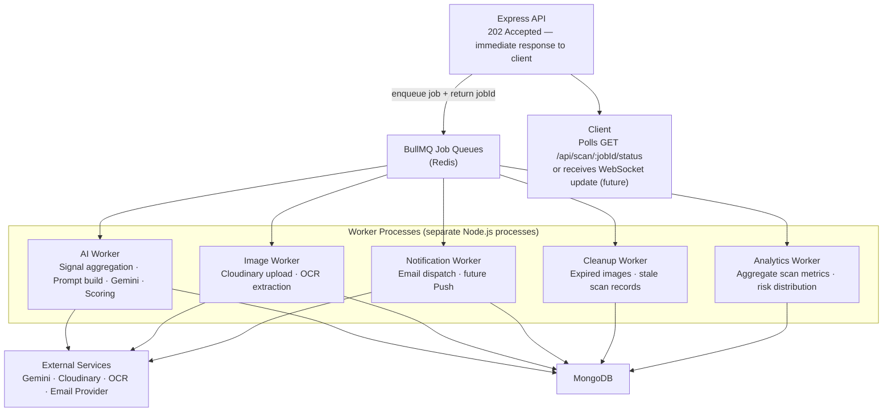

### 16.4 Job Lifecycle

1. The API enqueues a job with a unique `jobId` and returns `{ status: "queued", jobId }` immediately.
2. The client polls `GET /api/scan/:jobId/status` at a short interval, or holds a WebSocket connection for a server-pushed update (future).
3. The appropriate worker picks up the job, executes every stage, and writes the completed result to MongoDB.
4. Job status transitions to `completed`; the client fetches the full risk report.
5. On failure after the maximum retry count, the job moves to the dead-letter queue. The client receives a degraded result with an honest explanation of what could not be completed.

---

## 17. Monitoring and Observability

### 17.1 Why Observability Is Non-Negotiable in Production

A security platform that cannot observe its own behaviour cannot be trusted. Without structured logs, request tracing, and error tracking, the engineering team cannot diagnose incidents, measure SLA compliance, or confirm that detection accuracy holds in production. ScamShield AI implements observability from the first deployment — not as a post-launch retrofit.

### 17.2 Observability Stack

```mermaid
flowchart LR
    REQ["Inbound Request"]

    REQ --> RID["Request ID Middleware\nUUID assigned to every request\npropagated through all log lines and worker jobs"]
    RID --> LOG["Structured Logger\nJSON: requestId · userId · method · path · status · duration · scanType"]
    RID --> METRICS["Metrics Collector\nrequest count · p50/p95/p99 latency · error rate\nscan volume · cache hit rate · queue depth"]
    RID --> ERR["Error Tracker\nSentry (future)\nfull context on every unhandled exception"]

    HEALTH["GET /api/health\nDB · Redis · queue depth · external API reachability"]
    PERF["OpenTelemetry (future)\ndistributed traces across API · workers · external calls"]

    LOG --> DASH["Observability Dashboard"]
    METRICS --> DASH
    ERR --> DASH
    HEALTH --> DASH
    PERF --> DASH
```

### 17.3 Components

**Structured Logging.** Every log line is a JSON object with consistent fields across all modules: `requestId`, `userId` (if authenticated), `timestamp`, `level`, `service`, and `message`. Log levels follow `error > warn > info > debug`. Production deployments emit `info` and above; `debug` is enabled per-service via environment variable without a deployment change.

**Request IDs.** A UUID is generated for every inbound HTTP request and attached to `res.locals`. It propagates through every service call, repository query, worker job, and external API call in that request's lifetime. When an error surfaces, the `requestId` allows all related log lines across all components to be assembled in sequence for diagnosis.

**Health Endpoint.** `GET /api/health` returns a structured JSON object reporting the status of every critical dependency: MongoDB connection state, Redis connectivity, BullMQ queue depth, and reachability of primary external services. This endpoint is called by the deployment platform's health checks and is excluded from authentication and rate limiting middleware.

**Key Metrics.** Production metrics tracked from day one:

| Metric | What It Measures |
|--------|----------------|
| `scan.total` | Volume of scans, broken down by type |
| `scan.duration_ms` | AI pipeline latency percentiles (p50, p95, p99) |
| `scan.risk_distribution` | Safe / Low / Medium / High / Critical breakdown |
| `cache.hit_rate` | Percentage of scans served from cache vs. Gemini |
| `api.error_rate` | HTTP 4xx and 5xx rates by route |
| `queue.depth` | Number of pending background jobs per worker type |
| `auth.failure_rate` | Failed login attempts per time window (abuse signal) |

**Error Tracking — Sentry (Future).** Sentry integration will capture every unhandled exception with full request context, stack trace, source code location, and the user session that triggered it. It eliminates the difference between an error occurring and an engineer knowing about it.

**Performance Monitoring — OpenTelemetry (Future).** Distributed tracing via OpenTelemetry will provide end-to-end visibility across the Express API, BullMQ workers, MongoDB queries, and external API calls. When a scan takes longer than the p95 baseline, a trace will show exactly which stage introduced the latency without guesswork.

---

## 18. API Gateway

### 18.1 Current State — Express as Gateway

In the MVP, the Express application itself acts as the API gateway. It handles authentication via JWT middleware, rate limiting via `express-rate-limit`, request logging, and routing to feature modules. This is the right choice for the initial deployment: it is simple to reason about, requires no additional infrastructure, and introduces zero network hops between the gateway and the application logic.

### 18.2 Future State — Dedicated API Gateway

As the platform grows to serve the web application, mobile clients, Chrome extension, developer API, and enterprise tier simultaneously, a dedicated API gateway becomes the correct evolution. It offloads cross-cutting concerns from the application layer, provides a single authoritative entry point for traffic routing decisions, and enables per-tier rate limiting and authentication policies that would be cumbersome inside a monolithic Express app.

```mermaid
graph TD
    subgraph MVP["Current: Express as Gateway (MVP)"]
        C1["All Clients"] --> EX["Express Application\nAuth · Rate Limit · Logging · Routing"]
        EX --> F1["Feature Modules"]
    end

    subgraph Future["Future: Dedicated API Gateway"]
        C2["Web / Mobile / Extension"] --> GW["API Gateway\nKong · AWS API Gateway · Nginx"]
        Dev["Developer API Consumers"] --> GW
        GW -->|"JWT auth — user traffic"| SVC1["Core API Service"]
        GW -->|"API key auth — developer traffic"| SVC2["Developer API Service"]
        GW -->|"SSO auth — enterprise traffic"| SVC3["Enterprise Service"]
        SVC1 --> AI["AI Pipeline"]
        SVC2 --> AI
        SVC3 --> AI
    end
```

### 18.3 Responsibility Migration

| Responsibility | Current Owner (MVP) | Future Owner |
|---------------|--------------------|--------------------|
| Authentication | Express middleware | API Gateway |
| Rate limiting | `express-rate-limit` | Gateway (per-client, per-tier policies) |
| Request logging | Application-level logger | Gateway access log |
| API versioning | Route prefix (`/api/v1/`) | Gateway routing rules |
| Traffic routing | Express router | Gateway path-based and header-based rules |
| SSL termination | Application server | Gateway / CDN edge |

No existing architecture changes are required to adopt a dedicated gateway in the future. Express is already structured as a self-contained service that can sit behind a reverse proxy without modification.

---

## 19. Future Considerations

The following table documents the key architectural choices made for the MVP, the reasons each was selected, and the specific conditions under which each decision should be revisited. These are not indictments of the current choices — each was correct for the moment it was made.

| Current Choice | Reason Selected | Future Upgrade Path |
|----------------|----------------|---------------------|
| **Express Monolith** | Simplest deployment unit; fast iteration; shared memory appropriate for MVP-scale load; minimal operational surface | Extract the AI pipeline and notification service as independent processes when team size and sustained traffic volume justify the distributed-systems complexity they introduce |
| **MongoDB** | Schema flexibility suits evolving scan data shapes; rapid development without rigid migrations; document model maps naturally to scan records | Add read replicas for reporting queries; evaluate PostgreSQL for relational analytics and billing data if structured reporting requirements grow |
| **REST API** | Universally supported; simple to consume from any client type; well-understood caching semantics; no additional tooling required | GraphQL for flexible client-driven queries across scan types; WebSocket or Server-Sent Events for real-time scan completion updates without polling |
| **JWT + HTTP-only Cookie** | Stateless; no session store dependency at MVP scale; eliminates the most common XSS token theft vector; straightforward to implement correctly | Add OAuth 2.0 and social login providers; consider opaque tokens with a token introspection endpoint when enterprise SSO (SAML, OIDC) requirements arrive |
| **Gemini API** | State-of-the-art reasoning capability at launch; Google infrastructure reliability; competitive pricing at initial volume | Provider abstraction is already in place; swap or A/B test models without pipeline changes; self-hosted open-weight models for air-gapped enterprise deployments |
| **Single Backend Process** | Sufficient for MVP load; simpler debugging and deployment; no distributed system failure modes to manage | Horizontal scaling behind a load balancer; extract the AI pipeline as a dedicated worker service when queue depth becomes the bottleneck |
| **React SPA** | Component reusability shared with the Chrome extension; large ecosystem; full TypeScript support; no SSR infrastructure needed | Add server-side rendering (Next.js) for SEO performance on public-facing pages; React Native for the mobile application, sharing the same component primitives |
| **BullMQ + Redis** | Battle-tested job queue with excellent TypeScript support; handles retry, priority, and dead-letter queues natively out of the box | Add queue partitioning per scan type at high throughput; dedicated Redis cluster for queue isolation; explore cloud-native queues (SQS, Cloud Tasks) for managed infrastructure |
| **Cloudinary (Temporary Storage)** | Zero-ops image hosting and transformation; auto-expiry eliminates cleanup jobs; CDN delivery improves OCR pre-processing latency | Evaluate S3-compatible self-hosted storage if egress costs become material at scale; introduce a permanent archival tier if users request scan history with image evidence |

---

## 20. Conclusion

The ScamShield AI architecture is purpose-built for the demands of a security-sensitive, user-facing platform operating in an adversarial environment.

**Correctness is enforced structurally.** Strict layer separation means that business logic, data access, and presentation cannot bleed into each other. Zod validation at every entry point means malformed or malicious input is rejected before it touches any application logic. Centralised error handling means no error path leaks implementation details to clients.

**Security is layered, not bolted on.** Nine independent security mechanisms cover transport, application, authentication, input, authorisation, and persistence. Compromising one layer does not compromise the system.

**Scalability is compositional.** New scan types, new clients, and new tiers are added as new modules alongside existing ones — not as modifications to working code. The AI pipeline's prompt-based design means new detection capabilities are immediately available to all scan types without changes to individual pipeline implementations.

**The intelligence layer is replaceable.** The Gemini integration is encapsulated behind a single client wrapper. Switching AI providers, upgrading model versions, or routing different scan types to different models requires changes to one file, not to the scan pipelines that depend on it.

**Every component has a defined failure mode.** External service timeouts degrade gracefully. Token expiry is handled silently. Validation errors are informative. The system fails predictably — returning a partial result with an honest explanation rather than an opaque error.

This architecture supports the full MVP scope and provides a clear, low-friction expansion path to the browser extension, mobile application, enterprise tier, and developer API described in the product vision. It is not overengineered for current needs, and it is not underspecified for future growth.

---

*This document is authoritative for the initial system design. Deviations from this architecture during implementation must be documented in a corresponding Architecture Decision Record (ADR) under `docs/decisions/`. This document will be updated to reflect approved changes at the start of each subsequent development phase.*
