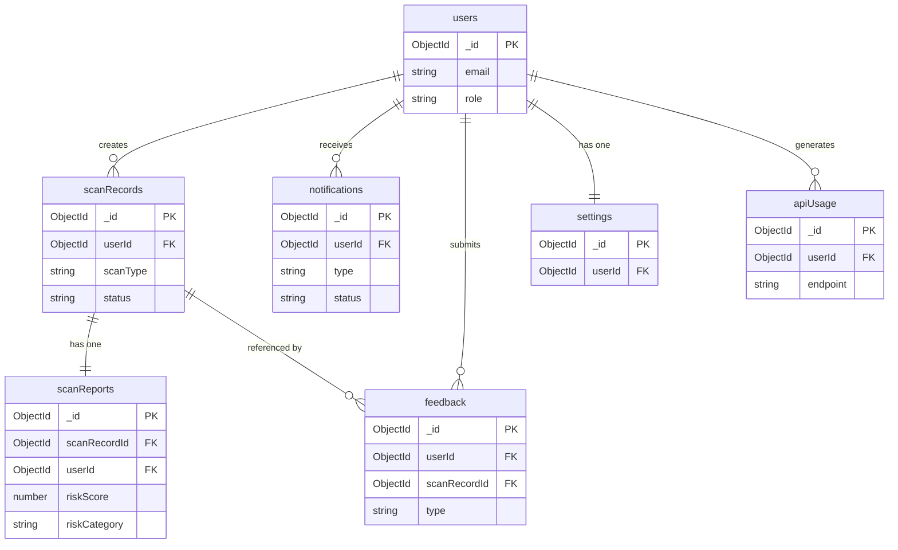

# ScamShield AI — Database Design

| | |
|---|---|
| **Version** | 1.0 |
| **Status** | Approved |
| **Related** | [02_Architecture.md](./02_Architecture.md), [06_API.md](./06_API.md) |

---

## 1. Database Overview

**Why MongoDB:** Scan records are structurally heterogeneous — a URL scan record carries different fields than an image scan record. MongoDB's document model accommodates this naturally without table inheritance or JSONB workarounds. Schema flexibility during active development, Atlas-managed infrastructure, and a native aggregation pipeline for dashboard analytics make it the correct choice for this platform.

**Collection strategy:** One collection per domain entity. Scan inputs and AI-generated reports are split into two collections (`scanRecords`, `scanReports`) to allow reports to be regenerated, versioned, or extended without mutating the original scan.

**Reference vs. Embedded:** References (`ObjectId`) are used for relationships between domain entities. Embedding is reserved for small, stable sub-documents that are always read with the parent (e.g., scan metadata flags within a report). Unbounded arrays are never embedded.

---

## 2. Collections

| Collection | Purpose |
|------------|---------|
| `users` | Account credentials, profile, refresh token, preferences |
| `scanRecords` | Raw scan inputs, source type, status, userId, timestamps |
| `scanReports` | AI-generated risk report linked to a scanRecord |
| `apiUsage` | Per-user API call tracking for rate limiting and billing |
| `notifications` | Queued and delivered notification records per user |
| `feedback` | User-submitted feedback or false-positive reports on a scan |
| `settings` | Per-user application preferences and notification configuration |

---

## 3. Collection Schemas

### 3.1 `users`

| Field | Type | Required | Description |
|-------|------|----------|-------------|
| `_id` | ObjectId | Auto | Primary key |
| `name` | String | Yes | Display name |
| `email` | String | Yes | Unique, lowercase, indexed |
| `passwordHash` | String | Yes | bcrypt hash, cost factor 12 |
| `refreshTokenHash` | String | No | Hashed refresh token; cleared on logout |
| `role` | String | Yes | `user` \| `admin` — default `user` |
| `isEmailVerified` | Boolean | Yes | Default `false` |
| `isActive` | Boolean | Yes | Default `true`; `false` = soft-suspended account |
| `isDeleted` | Boolean | Yes | Default `false` — soft delete |
| `deletedAt` | Date | No | Set on soft delete |
| `createdAt` | Date | Auto | Mongoose timestamps |
| `updatedAt` | Date | Auto | Mongoose timestamps |

**Primary Index:** `_id`
**Secondary Indexes:** `email` (unique), `isDeleted + createdAt` (compound)

---

### 3.2 `scanRecords`

| Field | Type | Required | Description |
|-------|------|----------|-------------|
| `_id` | ObjectId | Auto | Primary key |
| `userId` | ObjectId | Yes | Reference → `users._id` |
| `scanType` | String | Yes | `url` \| `email` \| `sms` \| `image` \| `qr` |
| `status` | String | Yes | `queued` \| `processing` \| `completed` \| `failed` |
| `input` | String | Yes | Raw user input (URL, pasted text, or Cloudinary URL for images) |
| `source` | String | No | `web` \| `extension` \| `api` — origin of the request |
| `ipAddress` | String | No | Hashed client IP for rate limiting and abuse detection |
| `isDeleted` | Boolean | Yes | Default `false` |
| `deletedAt` | Date | No | Set on soft delete |
| `createdAt` | Date | Auto | Mongoose timestamps |
| `updatedAt` | Date | Auto | Mongoose timestamps |

**Primary Index:** `_id`
**Secondary Indexes:** `userId + createdAt` (compound, desc), `status`, `scanType + createdAt`, `isDeleted`

---

### 3.3 `scanReports`

| Field | Type | Required | Description |
|-------|------|----------|-------------|
| `_id` | ObjectId | Auto | Primary key |
| `scanRecordId` | ObjectId | Yes | Reference → `scanRecords._id` |
| `userId` | ObjectId | Yes | Denormalised for query efficiency |
| `riskScore` | Number | Yes | 0–100 integer |
| `riskCategory` | String | Yes | `safe` \| `low` \| `medium` \| `high` \| `critical` |
| `confidence` | Number | Yes | 0.0–1.0 AI confidence level |
| `flags` | Array[String] | Yes | List of specific risk indicators raised |
| `explanation` | String | Yes | Plain-English summary for the user |
| `rawSignals` | Object | No | Raw external signal data (Safe Browsing, VirusTotal, WHOIS) |
| `aiProvider` | String | Yes | `gemini` — provider that generated this report |
| `modelVersion` | String | Yes | e.g. `gemini-1.5-pro` — for audit and comparison |
| `cacheHit` | Boolean | Yes | `true` if served from AI cache |
| `processingMs` | Number | No | Total pipeline duration in milliseconds |
| `createdAt` | Date | Auto | Mongoose timestamps |

**Primary Index:** `_id`
**Secondary Indexes:** `scanRecordId` (unique), `userId + riskCategory`, `userId + createdAt` (compound, desc)

---

### 3.4 `apiUsage`

| Field | Type | Required | Description |
|-------|------|----------|-------------|
| `_id` | ObjectId | Auto | Primary key |
| `userId` | ObjectId | Yes | Reference → `users._id` |
| `endpoint` | String | Yes | API route called, e.g. `/api/scan/url` |
| `scanType` | String | No | Scan type if applicable |
| `statusCode` | Number | Yes | HTTP response status |
| `processingMs` | Number | No | Server-side duration |
| `createdAt` | Date | Auto | Mongoose timestamps (TTL index: 90 days) |

**Primary Index:** `_id`
**Secondary Indexes:** `userId + createdAt`, `endpoint + createdAt` (analytics), TTL on `createdAt` (auto-expire after 90 days)

---

### 3.5 `notifications`

| Field | Type | Required | Description |
|-------|------|----------|-------------|
| `_id` | ObjectId | Auto | Primary key |
| `userId` | ObjectId | Yes | Reference → `users._id` |
| `type` | String | Yes | `emailVerification` \| `passwordReset` \| `scanAlert` \| `securityAlert` |
| `channel` | String | Yes | `email` \| `push` |
| `status` | String | Yes | `pending` \| `sent` \| `failed` |
| `payload` | Object | Yes | Template variables (subject, body data) |
| `sentAt` | Date | No | Timestamp when successfully dispatched |
| `failureReason` | String | No | Error message on failed delivery |
| `createdAt` | Date | Auto | Mongoose timestamps (TTL index: 30 days) |

**Secondary Indexes:** `userId + status`, `type + createdAt`, TTL on `createdAt` (auto-expire after 30 days)

---

### 3.6 `feedback`

| Field | Type | Required | Description |
|-------|------|----------|-------------|
| `_id` | ObjectId | Auto | Primary key |
| `userId` | ObjectId | Yes | Reference → `users._id` |
| `scanRecordId` | ObjectId | Yes | Reference → `scanRecords._id` |
| `type` | String | Yes | `falsePositive` \| `falseNegative` \| `generalFeedback` |
| `comment` | String | No | Free-text user comment (max 1,000 chars) |
| `resolved` | Boolean | Yes | Default `false` — reviewed by engineering |
| `createdAt` | Date | Auto | Mongoose timestamps |

**Secondary Indexes:** `userId`, `scanRecordId`, `resolved + createdAt`

---

### 3.7 `settings`

| Field | Type | Required | Description |
|-------|------|----------|-------------|
| `_id` | ObjectId | Auto | Primary key |
| `userId` | ObjectId | Yes | Unique reference → `users._id` |
| `emailNotifications` | Boolean | Yes | Default `true` |
| `scanAlertThreshold` | String | Yes | `medium` \| `high` \| `critical` — alert level |
| `defaultScanType` | String | No | Pre-selected scan type on dashboard load |
| `timezone` | String | No | IANA timezone string for display |
| `createdAt` | Date | Auto | Mongoose timestamps |
| `updatedAt` | Date | Auto | Mongoose timestamps |

**Primary Index:** `userId` (unique)

---

## 4. Relationships

---

## 5. Indexing Strategy

| Collection | Indexed Fields | Reason |
|------------|---------------|--------|
| `users` | `email` (unique) | Login lookup |
| `users` | `isDeleted, createdAt` | Soft-delete filtering on admin queries |
| `scanRecords` | `userId, createdAt DESC` | Scan history pagination |
| `scanRecords` | `scanType, createdAt` | Filter history by scan type |
| `scanRecords` | `status` | Background worker job pickup |
| `scanReports` | `scanRecordId` (unique) | Report lookup by scan |
| `scanReports` | `userId, riskCategory` | Dashboard risk distribution |
| `scanReports` | `userId, createdAt DESC` | Sorted history with report data |
| `notifications` | `userId, status` | Pending notification queue |
| `apiUsage` | `userId, createdAt` | Per-user usage analytics |
| `apiUsage` | `createdAt` (TTL: 90d) | Auto-expiry of usage logs |
| `notifications` | `createdAt` (TTL: 30d) | Auto-expiry of notification records |
| `feedback` | `resolved, createdAt` | Engineering review queue |

---

## 6. Data Lifecycle

| Stage | Behaviour |
|-------|----------|
| **Create** | All writes go through Mongoose schema validation + Zod middleware before reaching the repository |
| **Read** | All queries include `{ isDeleted: false }` filter by default via a Mongoose query middleware hook |
| **Update** | `updatedAt` is set automatically by Mongoose timestamps on every save |
| **Archive** | High-risk scan records are flagged for extended retention; standard records follow TTL policies |
| **Soft Delete** | `isDeleted: true` + `deletedAt: Date` set on users and scanRecords; hard deletes are not performed |
| **Hard Delete** | Never performed on `users` or `scanRecords`; only on `notifications` and `apiUsage` via TTL indexes |

---

## 7. Validation Rules

Validation is applied in layers — each layer catches what the previous one cannot.

| Layer | Tool | Catches |
|-------|------|---------|
| Client-side | Zod (shared schema) | Obvious input errors before the network request |
| API boundary | Zod middleware | Malformed or malicious request bodies; returns 400 |
| Application layer | Service logic | Business rule violations (e.g. duplicate email) |
| Database layer | Mongoose schema | Final type enforcement before any MongoDB write |

Zod schemas in `shared/schemas/` are the single source of truth. Mongoose schemas mirror them at the database layer. Client-side validation uses the same shared Zod schema imported from `shared/`.

---

## 8. Security

| Concern | Implementation |
|---------|---------------|
| Passwords | Never stored; `passwordHash` is a bcrypt hash (cost 12) |
| Refresh tokens | Stored as a bcrypt hash; plaintext never persists |
| Email addresses | Stored lowercase; not exposed in API responses beyond the authenticated user's own profile |
| IP addresses | Stored as a one-way SHA-256 hash for abuse detection; original IP is never persisted |
| Sensitive fields | `passwordHash`, `refreshTokenHash` are excluded from all query projections by default via Mongoose `select: false` |
| Timestamps | All timestamps stored as UTC; conversion to user timezone is a display-layer concern |
| Audit fields | `createdAt`, `updatedAt`, `deletedAt` are set by the application layer, never by the client |

---

## 9. Future Collections

| Collection | Purpose | Trigger |
|------------|---------|---------|
| `threatIntelligence` | Curated database of confirmed scam domains, phone numbers, and email patterns | Community Scam Database feature |
| `communityReports` | User-submitted scam reports pending moderation | Community feature launch |
| `organizations` | Enterprise multi-tenant account groups | Enterprise tier |
| `teams` | Members and roles within an organization | Enterprise tier |
| `apiKeys` | Developer API key records with rate limits and permissions | Developer API launch |

---

## 10. Decision Log

| Decision | Reason |
|----------|--------|
| MongoDB over PostgreSQL | Heterogeneous scan record structures favour a document model; schema flexibility during active development |
| References over embedding for user→scans | Unbounded one-to-many relationships must not be embedded; document size grows unboundedly otherwise |
| Soft delete on `users` and `scanRecords` | Preserves data integrity for audit, analytics, and accidental-deletion recovery |
| Separate `scanReports` collection | Allows reports to be regenerated or versioned without mutating the original scan input |
| `userId` denormalised on `scanReports` | Avoids a two-query join (report → scanRecord → userId) on every history page load |
| TTL indexes on `apiUsage` and `notifications` | Eliminates manual cleanup jobs; expired records are removed automatically by MongoDB |
| UTC timestamps everywhere | Avoids timezone-related data corruption; display conversion is a UI concern |
| `select: false` on sensitive fields | Prevents accidental exposure of `passwordHash` and `refreshTokenHash` in API responses |

---

## 11. Conclusion

This schema is designed around three principles. **Isolation** — scan inputs and AI reports are separate documents, so report regeneration, model versioning, and cache invalidation are all independent operations. **Safety** — soft deletes, hashed sensitive fields, `select: false` projections, and UTC timestamps eliminate the most common data integrity and security mistakes at the schema level. **Performance** — every common query pattern is covered by a compound index, TTL indexes automate cleanup, and denormalised `userId` fields on `scanReports` prevent multi-hop queries on the hot path.

As the platform grows, new collections are added alongside existing ones without modification. The schema does not need to be redesigned to support the enterprise tier, community database, or developer API — it is extended by addition.

---

| | |
|---|---|
| **Document Status** | Approved |
| **Version** | 1.0 |
| **Owner** | Engineering Team |
| **Next Document** | [06_API.md](./06_API.md) |
