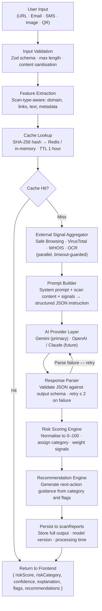

# ScamShield AI — AI Architecture

| | |
|---|---|
| **Version** | 1.0 |
| **Status** | Approved |
| **Related** | [02_Architecture.md](./02_Architecture.md), [06_API_Part2.md](./06_API_Part2.md), [05_Database.md](./05_Database.md) |

---

## 1. AI Goals

| Goal | Definition |
|------|-----------|
| **Accurate detection** | Identify scams that pattern-matching and reputation checks miss — novel threats, AI-generated content, zero-day phishing |
| **Explainable results** | Every risk score is accompanied by specific flags and a plain-English explanation; no black-box verdicts |
| **Fast responses** | Target p95 AI pipeline latency under 8 seconds; cache layer eliminates repeat API calls |
| **Modular providers** | The AI provider is a swappable implementation detail; the pipeline logic does not change when the provider does |
| **Human-readable output** | Explanations are written for a non-technical user; technical signals are surfaced separately for advanced users |

---

## 2. AI Pipeline

---

## 3. Supported Scan Types

| Scan Type | Input | Pre-processing | AI Focus |
|-----------|-------|---------------|---------|
| **URL** | HTTP/HTTPS string | Redirect resolution, domain extraction, Safe Browsing + VirusTotal + WHOIS | Domain age, lookalike patterns, redirect anomalies, content mismatch |
| **Email** | Body text (+ optional headers) | URL extraction → sub-scans (max 5), urgency keyword detection | Social engineering language, impersonation, sender/domain mismatch |
| **SMS** | Message text | Shortlink expansion, phone number pattern extraction | Smishing templates, OTP solicitation, authority impersonation |
| **QR Code** | Image file | QR decode → route to URL or text pipeline | URL: same as URL scan · Text: same as SMS scan |
| **Image** | JPEG / PNG / WEBP | Cloudinary upload → OCR → URL extraction from text | Brand logo vs. domain mismatch, overlaid URL deception, screenshot scam patterns |

---

## 4. AI Provider Layer

The AI provider is encapsulated behind a single interface in `server/src/lib/gemini.client.ts`. The pipeline calls `aiProvider.complete(prompt)` and receives a typed response. No pipeline stage imports the Gemini SDK directly.

**Current provider:**

| Provider | Model | Reason Selected |
|----------|-------|----------------|
| **Gemini** | `gemini-1.5-pro` | 1M token context window; native JSON output mode; Google ecosystem alignment with Safe Browsing |

**Future providers:**

| Provider | Trigger | Use Case |
|----------|---------|---------|
| **OpenAI GPT-4o** | Gemini availability incident | Hot-swap fallback; client interface is identical |
| **Anthropic Claude** | Strong instruction-following requirement | Complex email and document analysis |
| **Local / self-hosted (Llama, Mistral)** | Cost optimisation at high volume | High-frequency, lower-complexity scan types |

Provider switching is a configuration change, not a code change.

---

## 5. Prompt Strategy

| Rule | Detail |
|------|--------|
| **Structured system prompt** | Every prompt begins with a fixed system instruction: role, output format, reasoning instructions, and forbidden behaviours |
| **JSON-only responses** | Gemini's JSON output mode is used; the model returns nothing outside the defined schema |
| **Explainable reasoning** | The model lists specific evidence for each flag — not general conclusions |
| **Deterministic output** | Temperature `0`; responses are reproducible for the same input and signals |
| **No chain-of-thought exposure** | Internal reasoning steps are not returned to the client; only the structured output is surfaced |
| **Signal injection** | External signals (WHOIS date, Safe Browsing verdict, VirusTotal hits) are embedded as structured context |
| **Scan-type context** | The prompt explicitly states the scan type so the model applies the correct risk heuristics |
| **Max output tokens** | Capped per scan type to prevent runaway completions; explanation fields have character limits |

---

## 6. Risk Scoring

### Score → Category Mapping

| Score | Category | Visual Treatment |
|-------|----------|-----------------|
| 0–20 | **Safe** | Green badge · low RiskMeter fill |
| 21–40 | **Low Risk** | Lime badge · low-medium fill |
| 41–60 | **Medium Risk** | Amber badge · half fill |
| 61–80 | **High Risk** | Red badge · high fill |
| 81–100 | **Critical** | Dark red badge + alert banner · full fill |

### Score, Confidence, and Explanation — Working Together

| Field | Role in the Result |
|-------|-------------------|
| `riskScore` | Numerical severity 0–100; drives the RiskMeter and category label |
| `confidence` | Model certainty 0.0–1.0; below `0.6` the UI surfaces a low-confidence disclaimer |
| `explanation` | Plain-English reason written for a non-technical user; always accompanies the score |

A score of 75 at confidence 0.95 is a definitive High Risk result. A score of 65 at confidence 0.40 is uncertain — both the score and the disclaimer are displayed.

---

## 7. AI Output Schema

| Field | Type | Description |
|-------|------|-------------|
| `riskScore` | integer (0–100) | Normalised risk score |
| `riskCategory` | string | `safe` \| `low` \| `medium` \| `high` \| `critical` |
| `confidence` | float (0.0–1.0) | Model certainty in the assessment |
| `summary` | string | One-sentence verdict ≤ 120 chars — used in history feed and notifications |
| `explanation` | string | 2–4 sentence plain-English explanation |
| `redFlags` | string[] | Specific risk indicators, each ≤ 80 chars |
| `recommendations` | string[] | 1–3 concrete next-action suggestions for the user |
| `detectedSignals` | object | Raw external signals: `{ safeBrowsing, virusTotal, domainAge, urlCount }` |
| `modelVersion` | string | Provider model identifier e.g. `gemini-1.5-pro` |
| `analysisVersion` | string | Internal pipeline version e.g. `1.0.0` — used for audit and cache invalidation |

---

## 8. Failure Handling

| Failure Mode | Behaviour |
|-------------|-----------|
| **AI provider timeout** (> 15 s) | Degraded result: signal-only score, `confidence: 0`, user-facing explanation of partial analysis |
| **Invalid JSON response** | Retry with format-correction instruction; max 2 retries; degraded result on third failure |
| **API error (5xx)** | Retry once after 1 s backoff; degraded result on second failure; alert logged |
| **Rate limit (429)** | Queue for retry via BullMQ with exponential backoff; scan status remains `processing` |
| **External signal timeout** | Signal contributes `null`; pipeline continues; low-confidence flag added to output |
| **OCR failure** | Image scan returns degraded result; no AI call made on empty OCR output |
| **Cache write failure** | Error logged; result returned to user without caching; non-blocking |

**Degraded result guarantee:** The platform always returns a response. A degraded result includes all signals that could be gathered, an honest `confidence: 0`, and a plain-English explanation of what was unavailable.

---

## 9. Future AI Enhancements

| Enhancement | Description | Trigger |
|-------------|-------------|---------|
| **Multi-model routing** | Route scan types to different models by complexity and cost | Developer API launch with volume requirements |
| **AI ensemble** | Two providers in parallel; merge on agreement, flag for review on divergence | Enterprise high-stakes scanning tier |
| **Fine-tuned models** | Fine-tune on ScamShield AI's confirmed scam and feedback dataset | Sufficient labelled feedback data accumulated |
| **Threat intelligence injection** | Inject community scam database signals into prompt context | Community Reports feature launch |
| **Autonomous re-scan** | Re-analyse saved scans when new intelligence alters a known domain's risk profile | Threat intelligence feed integration |

---

## 10. Decision Log

| Decision | Reason |
|----------|--------|
| Gemini as primary provider | Superior context window for long email/document scans; JSON mode removes parse ambiguity |
| Provider abstraction from day one | Cost, capability, and availability will all change; swapping must be a config change, not a refactor |
| Temperature = 0 | Reproducibility is a correctness requirement for a security tool; variation is not acceptable |
| JSON output mode over free-form text | Free-form parsing introduces fragility; JSON mode guarantees schema compliance |
| No chain-of-thought in response | Exposing reasoning creates a larger attack surface for prompt injection and jailbreaking |
| Confidence field on every result | Prevents the UI from presenting a low-certainty result as a definitive verdict |
| Degraded result on any failure | Silent failure is unacceptable for a security tool; users always receive an honest status |
| Cache keyed on content hash + scan type | Identical content from different users does not re-invoke the AI; cost and latency both reduced |

---

## 11. Conclusion

The AI pipeline's design prioritises three properties above all others: **correctness** (structured output, zero temperature, retry on parse failure), **honesty** (confidence scoring, degraded results on failure, no black-box verdicts), and **replaceability** (provider abstraction, config-driven model selection). The pipeline does not need to be rebuilt to switch AI providers, add new scan types, or scale to enterprise volumes — it extends by configuration and composition.

---

| | |
|---|---|
| **Document Status** | Approved |
| **Version** | 1.0 |
| **Owner** | Engineering Team |
| **Next** | 🚀 Development Sprint 1 |
